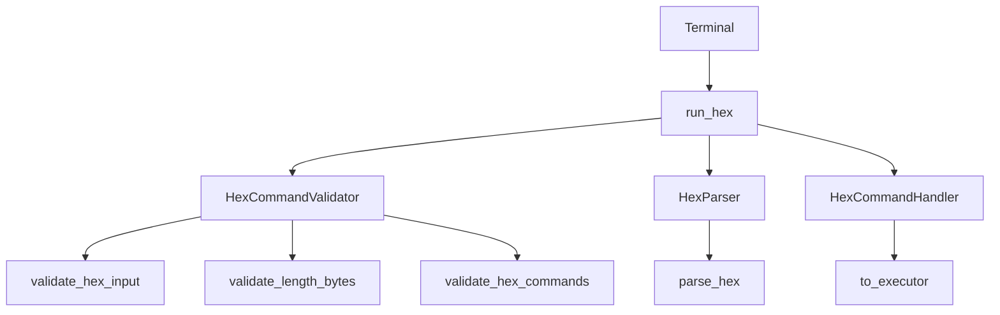
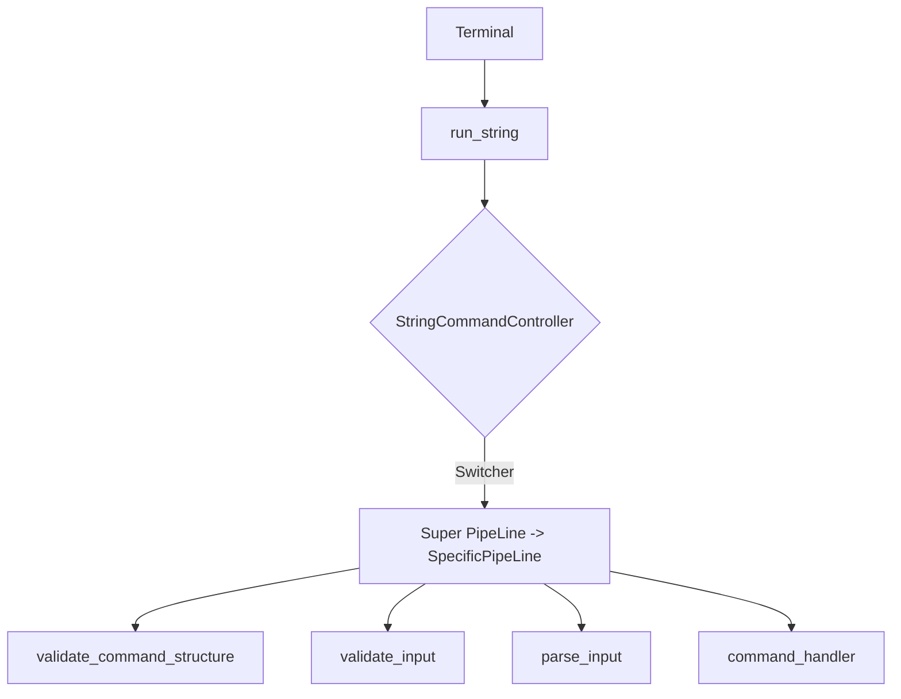

# Terminal

## Solution Overview

In my solution, I implement a terminal that can take either:  

- hex streams (`0x01 0x03 0x50 0x18 0x01 0x03 0x06 0x3C 0x02 0x03 0x0A 0x07 0x2A 0xFF`)
-  string inputs (`screen_setup 80 24 16colors` - translated internally to hex: **0x01 0x03 0x50 0x18 0x01 0xFF** )

The challenge was to ensure that the two pipelines (hex and string) remained consistent, robust, and easy to extend. Sufficiently respecting the SOLID principles


## Hex Execution Pipeline  


### Architecture

1. **Hex Input Validation** - Ensure the incoming hex stream is convertable to hex commands without breaking.  
2. **Command Parsing** - Convert the hex stream into a series of executable commands
3. **Command Validation** - Ensure all executable commands are accurate and executable
4. **Command Execution** - Iteratively pass all validated commands for execution  

> The goal behind this architecture in the pipeline is to ensure easy to follow and debug steps that each validate or transform the data up to the point of execution  

**Solid principles implemented to achieve this are:**  

- `Single Responsibility Principle (SRP)` - Each class and method handles a single aspect of the pipeline. For example, validation, parsing, and execution are separated into distinct methods
- `Open/Closed Principle (OCP)` - The [COMMANDS dictionary](https://github.com/VictorCodebase/CustomTerminal/blob/main/Constants.py) allows for easy extension with new commands without modifying existing code.


### Example flow

Consider this input hex stream:

```Python
0x01 0x03 0x50 0x18 0x01 0x03 0x06 0x3C 0x02 0x03 0x0A 0x07 0x2A 0xFF
```

*The terminal uses " " and "," as delimeters to get a `raw string stream`*  

|Hex Command Pipeline|
|---|
|**Hex Input Validation** - runs methods to ensure all the strings in the `raw string stream` are convertable to hex and parsable |
|*Output: True*|
|**Command Parsing** Converts the `raw string stream` to a `hex command stream`|
|*Output: [0x01 0x03 0x50 0x18 0x01 0xFF], [0x03 0x06 0x3C 0x02 0x03 0x0A 0x07 0x2A 0xFF]*|
|**Command Validation** Runs checks on all command streams in the `hex command stream` to ensure all of the are executable|
|*Output: True*|
|**Command Execution** Validated commands are iteratively ran through the executor for execution|
|*Output: True*|

### Running Hex Commands
To setup your environment and clone this project, please follow instructions here: [**Instructions**](https://github.com/VictorCodebase/CustomTerminal/edit/main/README.md#running-the-solution)

Run the program:
```bash
python terminal.py
```

## String Execution Pipeline



### Architecture:
 The architecture follows this flow. Should you enter the command:
```Bash
screen_setup 80 24 16colors
``` 

|String Command Pipeline|
|---|
| 1. **CommandPipeline Intiation** - A correspoding execution pipeline class is instantiated by *StringCommandController* |
|*Output: ScreenSetupPipeLine(CommandPipeline)*|
| 2. **Command Structure Validation** Pipeline ensures the command has the right number of arguments |
|*Output: True*|
| 3. **Command Argument Validation** PipeLine ensures that all commands are recognized and are convertable to hex |
|*Output: True*|
| 4. **Command Parsed** PipeLine converts all commands to the expected Hex value according to the command |
|*Output: 0x01 0x03 0x50 0x18 0x01 0xFF*|
| 5. **Command Execution** PipeLine passes command to the executor to be ran |
|*Output: True*|
  

> The goal of this Architecture is to embrace the Open/Closed Principle to ensure adding new commands does not affect the interparation of other commands.

### Running String Commands
To setup your environment and clone this project, please follow instructions here: [**Instructions**](https://github.com/VictorCodebase/CustomTerminal/edit/main/README.md#running-the-solution)

Run the program:
```Bash
python terminal.py --readable
```

## Running the solution  

### Preriquisites

1. **Python 3.8 or higher**  
   Download Python from [python.org](https://www.python.org/downloads/).

2. **Dependencies**  
   Ensure the following standard Python libraries are available:
   
   - `argparse` (for parsing command-line arguments)
   - `sys` (for system-level operations)

3. **Terminal Emulator**  
   A terminal or command prompt (e.g., `bash`, `zsh`, `cmd`, or `PowerShell`).

---

### Step-by-Step Setup

### 1. Clone the Repository

Open your terminal or command prompt and run:

```bash
git clone <repository-url>
cd <repository-folder>

